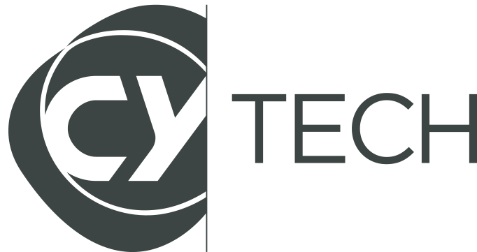

## Sommaire
- [Contenu](#contenu) Expliquer ce qu'est le projet ainsi que ses fonctionnalités
- [Objectif](#objectif) Expliquer le but de ce projet
- [Groupe](#groupe) Les membres du groupe 
- [Fichiers](#fichiers) Quels sont les fichiers et leurs fonctions
- [Compiler](#compiler) Comment compiler le projet
- [Prérequis](#prérequis) Les bibliothèques à installer 
- [Utilisation_de_l'application](#utilisation_de_l'application) Comment utiliser l'application
- [Sources](#sources) Les ressources sur lesquelles nous nous sommes basées


## Contenu

Ce projet est une plateforme numérqiue intelligente qui regroupe divers services et fonctionnalités pour les utilisateurs d'une université. Cette plateforme contient plusieurs modules qui sont accessibles selon le type d'utilisateur (visiteur, simple, complexe et administateur).   
Le module "Information" conresponds à la page d'accueil quand les utilisateurs ne sont pas connectés (les visiteurs) pour voir les actualités et quelques informations locales.  
Le module "Visualisation" accessible seulement aux personnes inscrites sur la plateforme et apparetenant à l'université (cette condition est vérifiée via un envoi de mail sur l'adresse de l'école @etu.cyu.fr). Ainsi l'utilisateur de type simple a accès au module "Information" mais peut également modifier son profil, recherhcer et consulter des objets.   
<<<<<<< Updated upstream
Le module "Gestion" est dédier aux utilisateurs de type complexe (qui ont aussi accès aux modules "Information" et "Visualisation"). Ce module est une sorte de tableau de bord avancé
=======
Le module "Gestion" est dédier aux utilisateurs de type complexe (qui ont aussi accès aux modules "Information" et "Visualisation")
>>>>>>> Stashed changes

## Objectif

## Groupe

Notre groupe est d'Orianne COURTADE, Alban SOUPPAYA, Medhi BOULAICH EL KHADRI et Saïd BELKACEM.

## Fichiers

## Compiler
Avant de lancer et compiler le projet vous devez aller dans le dossier "DevWebProjet" est lancer l'environnement virtuel à l'aide des commandes suivantes:
```
.\venv\Scripts\activate
cd ..
flask run
```

## Prérequis

Vous devez en premier lieu télécharger le dossier DevWebProjet à partir du dépot git, ensuite entrez dans le dossier et créez un environnement virtuel à l'aide des commandes suivantes :
```
python -m venv venv
```
 >[!NOTE] 
 >Il faut activer les scripts pour windows
 Ensuite vous devez activer l'environnement virtuel:
```
.\venv\Scripts\activate 
```
Afin d'installer toutes les bilbliothèques nécessaires il faut exéctuer sous windows: 
```
pip install -r biblioRequise.txt
```
Une fois toutes les bibliothèques installer, vous devez modifier les variables d'environnement de votre environnement virtuel:
```
[System.Environment]::SetEnvironmentVariable("FLASK_APP", "DevWebProjet", "User")
[System.Environment]::SetEnvironmentVariable("FLASK_DEBUG", "1", "User")

```

## Utilisation_de_l'application

## Sources 

# CY_Tech

